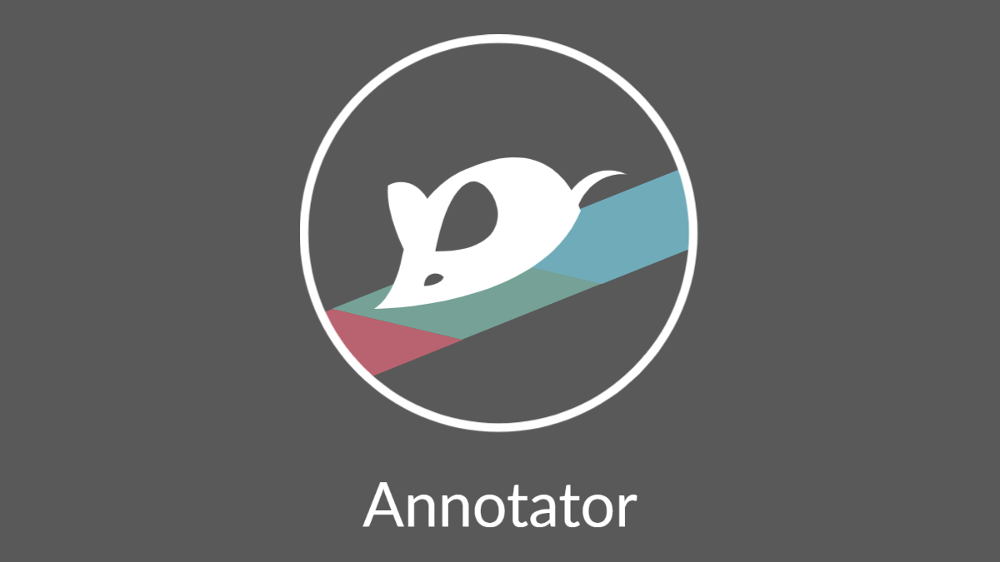
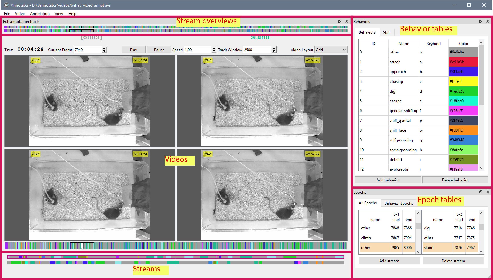
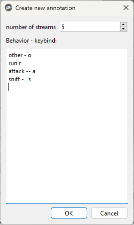

# Behavior Annotator



# Table of contents

- [Installation](#installation)
- [Usage](#usage)
  - [GUI](#GUI)
  - [Video](#video)
  - [Annotation](#annotation)
  - [KeyPress Functions](#keypress-functions)
- [Contributing](#contributing)
- [Acknowledgement](#acknowledgement)
- [License](#license)

# Installation

1. Install Git
2. In git bash, run

```bash
git clone https://github.com/hsingchien/Bannotator.git
```

3. In anaconda prompt, go to annotator directory, run

```bash
conda env create -f environment.yml
```

4. Then activate the environment

```bash
conda activate bannotator
```

5. Under this environment, go to the bannotator directory, run

```bash
python setup.py develop
```

6. To open the app, under this environment, run

```bash
annotate-behavior
```

# Usage

### GUI



The GUI layout has 5 major areas.

- A video area, where you can add display of multiple videos.
- Stream area shows the enlarged portion of the color coded streams.
- Stream overviews provide the bird's view of the full annotation and the progress.
- Behavior tables dock where ID, name, keystroke and color are shown in the Behaviors tab; number of epochs and percentage of the time are shown in the Stats tab.
- Epoch tables where epochs are shown in the All Epochs tab, epochs of selected behaviors are shown in the Behavior Epochs tab.

### Video

- Annotator supports major video formats and the Norpix Streampix seq files. Only uncompressed seq (RAW) or compressed seq in JPEG format are currently supported.

- Annotator is capable of displaying multiple videos simultaneously, there is ideal for experiments with multiple video streams. If videos have different number of frames, the 1st added video is treated as the main video and the other videos are stretched to the length of the video 1.

- Annotator provides several different video layouts. Side by side, Stacked or Grid (this option becomes available when number of videos reaches 4).

- Video can be played at various speed.

### Annotation

The annotator is compatible with the format of annotation txt file of [Piotr's MATLAB toolbox](https://github.com/pdollar/toolbox). If you are a user of the behavior annotator of this toolbox, you can view/edit your existing annotation files as well as create new annotation using your old configuration files. The output file of this annotator is also back compatible with Piotr's annotator.

If you are not familiar with the Piotr's toolbox, you can create an new annotation from scratch using `New annotaion` function in the `Annotation` menu. To enable this option you need to add a video first to let the annotator know the length of the annotation.



Set the number of streams. In text editor, input behavior - keystroke pair on each line, parsed by '-' or space. The input must be unique word and letter pairs otherwise the it is rejected by the dialog. Once created, all the streams will be filled with the first behavior in your list. Usually the first behavior label is reserved for the "blank" label. Name this behavior as "other" or "blank", the annotator will assign grey color to it.

Once the new streams are created, you can now go through the video and make labels. Press keystroke to label the current frame as well as the rest of the Epoch. Epoch is the fundamental unit of the annotation. An `Annotation` contains `Streams` which contains a series of `Epoch`. Each `Stream` also contains several `Behavior` objects each one of which stores the name, color, keystroke and ID of user defined behaviors. `Behavior` objects also collects all the `Epochs` of this kind in its stream.

### KeyPress Functions

<kbd>Space</kbd> : Play/Pause video

<kbd>&#8593;</kbd> / <kbd>&#8595;</kbd> : Increase/Decrease playing speed

<kbd>&#8592;</kbd> / <kbd>&#8594;</kbd> : Previous/Next frame

<kbd>1</kbd> - <kbd>0</kbd> : Change the current stream to stream 1 - 10

<kbd>`</kbd> : Rotate current stream

<kbd>-</kbd>/<kbd>+</kbd> : Move to previous/next epoch of current stream

<kbd>CTRL</kbd><kbd>-</kbd>/<kbd>CTRL</kbd><kbd>+</kbd> : Move to previous/next epoch of selected behavior

# Contributing

Your contributions are always welcome! Contribution guideline will be available soon.

# Acknowledgement

This project is inspired by [Piotr's MATLAB toolbox](https://github.com/pdollar/toolbox).

Although is not used in the annotator, [PIMS](https://github.com/soft-matter/pims) helped with seq file reading.

The project is built with PySide6.

# License

The MIT License (MIT) 2017 - [Xingjian Zhang](https://github.com/hsingchien/).
